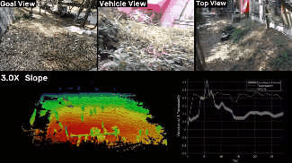
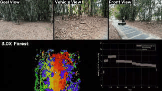
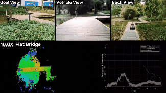
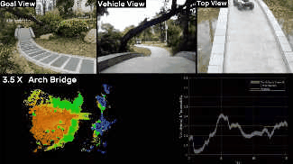
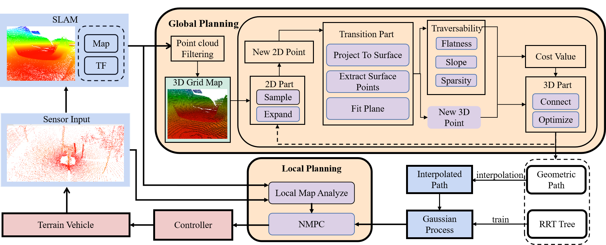
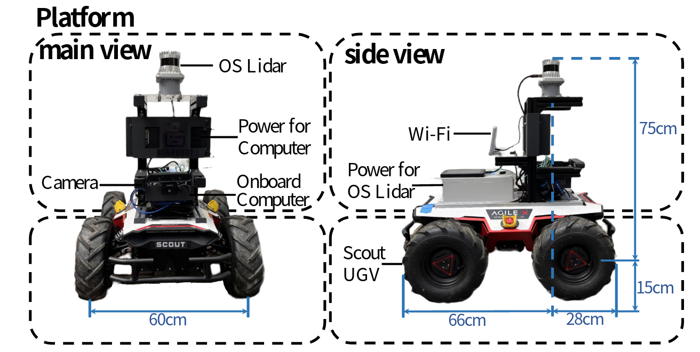

# PUTN

# LVI-SAM-LIVOX usage
<p align = "center">

</p>

https://github.com/jianhengLiu/LVI-SAM-LIVOX
```
roslaunch putn_launch simulation.launch scene:="maze"
roslaunch lvi_sam run_putn.launch
```

PUTN: A Plane-fitting based Uneven Terrain Navigation Framework.

**PUTN** is a plane-fitting based uneven terrain navigation framework, which allows **UGV** to traverse different kinds of **unstructured** and **complex** environments outdoors. 

<p align = "center">




</p>


PUTN consists of three parts:

- Global Planning Module (Implemented by **PF-RRT***)
- GPR Module
- Local Planning Module (Implemented by **NMPC**)

<p align = "center">

</p>

**Video Links:** [YouTube](https://www.youtube.com/watch?v=3ZK-Ut29hLI), [bilibili](https://www.bilibili.com/video/BV1bZ4y1r7na?spm_id_from=333.337.search-card.all.click&vd_source=e11d8557ce1350ea4930d15280abb7e2) (for Mainland China)

## 1. Related Paper

PUTN: A Plane-fitting based Uneven Terrain Navigation Framework, Zhuozhu Jian, Zihong Lu, Xiao Zhou, Bin Lan, Anxing Xiao, Xueqian Wang, Bin Liang (Accepted by IROS). [arXiv Preprint](https://arxiv.org/pdf/2203.04541.pdf) .

## 2. Compilation

**Requirements**: Ubuntu 16.04, 18.04 with ros-desktop-full installation.

**Step 1**. Install [A-LOAM](https://github.com/HKUST-Aerial-Robotics/A-LOAM). And this part can be replaced by other 3D SLAM algorithms.

**Step 2**. The following packages should be installed before PUTN is compiled.

```
sudo apt-get install ros-melodic-ompl
sudo apt-get install ros-melodic-robot-state-publisher*
sudo apt-get install ros-melodic-joint-state-controller*
sudo apt-get install ros-melodic-controller*
sudo apt-get install ros-melodic-velocity-controllers*
sudo apt-get install ros-melodic-eigen*
sudo apt-get install ros-melodic-velodyne*
pip install casadi
```

**Step 3**. Clone the repository and catkin_make.

```
mkdir -p putn_ws/src
cd putn_ws/src/
catkin_init_workspace
git clone https://github.com/jianzhuozhuTHU/putn.git
cd ..
rosdep install --from-paths src --ignore-src --rosdistro=melodic -y
catkin_make
```

The entire compilation process may take 5-10 minutes.

**Step 4**. Add permission to Python files.

```
cd putn_ws/src/putn/src/putn/putn_mpc/scripts
sudo chmod +x *
```

## 3. Application

### 3.1. Simulation

PUTN simulation is based on [Gazebo](https://gazebosim.org/home). At present, two simulation scenarios are provided, namely **mountain** environment and **pothole** environment. 

Run the following commands in the terminal to open the PUTN simulation environment and algorithm.

```
cd putn_ws
source devel/setup.bash
roslaunch putn_launch simulation.launch scene:="scenario name" 
```

The scenario name can be "map1" (default) or "map2". The movement of the robot can be freely switched to manual keyboard control mode and autonomous navigation mode in terminal window "controller.py": 

```
Reading from the keyboard  and Publishing to Twist!
---------------------------
Moving around:
   q    w    e
   a    s    d
   z    x    c

i : switch to autonomous navigation mode
```
<p align = "center">

</p>

Before PUTN is working, you should:

1. Use the keyboard to control the robot to the ground, until RRT tree generation
2. Use "3D Goal" on the RVIZ interface to choose a goal point
3. Press "i" to switch to autonomous navigation mode

then you can see the robot start to move towards the goal point.

**PS.** To get the best map building results, you should set the resolution of the point clouds generated by A-LOAM in advance. In our experiments, "mapping_line_resolution" and "mapping_plane_resolution" are set as 0.03 and 0.05 respectively

### 3.2. Real Scenarios

[Scout 2.0](https://www.agilex.ai/index/product/id/2?lang=zh-cn), four-wheel-drive mobile robot is used for the experiment. The lidar sensor is [OS0-128](https://ouster.com/products/scanning-lidar/os0-sensor/), and the computational hardware is [Intel® NUC](https://www.intel.com/content/www/us/en/products/details/nuc.html) with an i5 2.4GHz CPU and 16GB memory. PUTN algorithm sends instructions to the robot in the form of ROS topic ([geometry_msgs/Twist Message](http://wiki.ros.org/geometry_msgs)), and Scout 2.0 can be replaced by other four-wheel-drive mobile robots.

<p align = "center">

</p>

**Step 1**. Run robot chassis drive.

**Step 2**. Run lida drive.

**Step 3**. Run the following commands in the terminal to open the PUTN algorithm.

```
cd putn_ws
source devel/setup.bash
roslaunch putn_launch bringup.launch
```

## 4. Recommendation

In the process of algorithm running, the SLAM module and the planning module often occupy the resources of each other due to the limitation of computer performance. This may cause delay or lowering the frequency of TF. If this happens, it is recommended to run the SLAM module and the planning module on separate onboard computers.

# Licence

The source code is released under [GPLv3](http://www.gnu.org/licenses/) license.

# Maintaince

We are still working on extending the proposed system and improving code reliability. 

For any technical issues, please contact Zhuozhu Jian (jzz21@mails.tsinghua.edu.cn) or Zihong Lu (200320802@stu.hit.edu.cn).

For commercial inquiries, please contact Zhuozhu Jian (jzz21@mails.tsinghua.edu.cn).


