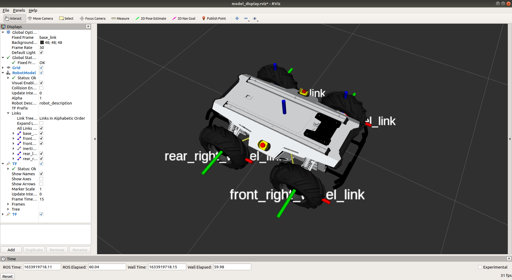
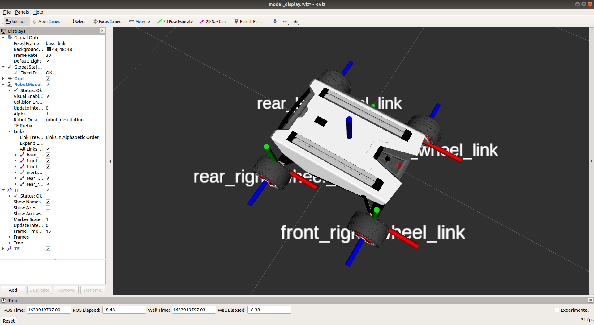
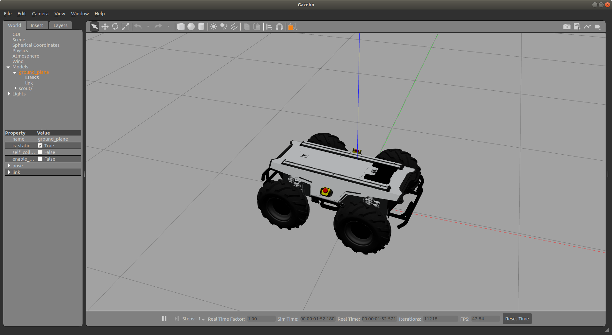
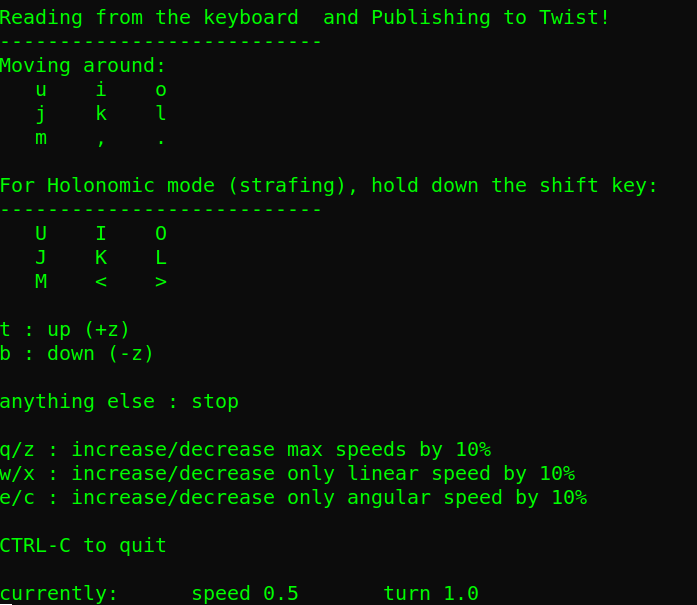
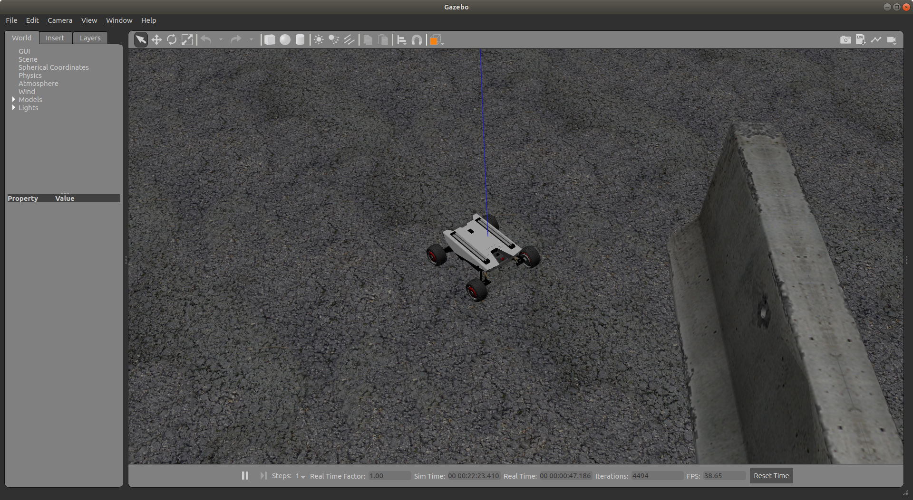

[TOC]

# Scout Simulation Operation Process

## 1.	Introduction of Function Package

```
├── scout_control
├── scout_description
└── scout_gazebo_sim
```

​	scout_gazebo_sim：The folder is gazebo simulation function package

​	scout_control: The folder is simulation controller function package

​	scout_description: The folder is the function package of model file

## 2.	Environment

### Development Environment

​	ubuntu 18.04 + [ROS Melodic desktop full](http://wiki.ros.org/melodic/Installation/Ubuntu)

### Download and install required function package

​	Download and install ros-control function package, ros-control is the robot control middleware provided by ROS

```
sudo apt-get install ros-melodic-ros-control
```

​	Download and install ros-controllers function package, ros-controllers are the kinematics plug-in of common models provided by ROS

```
sudo apt-get install ros-melodic-ros-controllers
```

​	Download and install gazebo-ros function package, gazebo-ros is the communication interface between gazebo and ROS, and connect the ROS and Gazebo

```
sudo apt-get install ros-melodic-gazebo-ros
```

​	Download and install gazebo-ros-control function package, gazebo-ros-control is the communication standard controller between ROS and Gazebo

```
sudo apt-get install ros-melodic-gazebo-ros-control
```

​	Download and install joint-state-publisher-gui package.This package is used to visualize the joint control.

```
sudo apt-get install ros-melodic-joint-state-publisher-gui 
```

​	Download and install teleop-twist-keyboard function package, telop-twist-keyboard is keyboard control function package, the robot can be controlled to move forward, left, right and backward through "i", "j", "l",and "," on the keyboard

```
sudo apt-get install ros-melodic-teleop-twist-keyboard 
```


## 3.	About Usage

### 1、1.	Create workspace, download simulation model function package and compile

​		Open a new terminal and create a workspace named scout_ws, enter in the terminal:

```
mkdir scout_ws
```

​		Enter the scout_ws folder

```
cd scout_ws
```

​		Create a folder to store function package named src

```
mkdir src
```

​		Enter the src folder

```
cd src
```

​		Initialize folder

```
catkin_init_workspace
```

​		Download simulation model function package

```
git clone https://github.com/agilexrobotics/ugv_sim/scout.git
```

​		Enter the scout_ws folder

```
cd scout_ws
```

​		Confirm whether the dependency of the function package is installed
```
rosdep install --from-paths src --ignore-src -r -y 
```

​		Compile

```
catkin_make
```


### 2、2.	Run the star file of scout_v2 and scout_mini, and visualize the urdf file in Rviz

​	Enter the scout_ws folder

```
cd scout_ws
```

​	Declare the environment variable

```
source devel/setup.bash
```

​	Run the start file of scout_v2 model and visualize the model in Rviz

```
roslaunch scout_description display_scout_v2.launch 
```

 

​	Run the start file of scout_mini model and visualize the model in Rviz

```
roslaunch scout_description display_scout_mini.launch 
```

 

### 3、3.	Start the gazebo simulation environment of scout_v2 and scout_mini and control scout_v2 and scout_mini movement in the gazebo

​	Enter the scout_ws folder

```
cd scout_ws
```

​	Declare the environment variable

```
source devel/setup.bash
```

​	Start the simulation environment of scout_v2

```
roslaunch scout_gazebo_sim scout_empty_world.launch
```

 

#Control by keyboard, the scout2.0 and scout_mini can be controlled to move forward, left, right and backward through "i", "j", "l",and "," on the keyboard

```
rosrun teleop_twist_keyboard teleop_twist_keyboard.py 
```

 

​	Start the simulation environment of scout_mini

```
roslaunch scout_gazebo_sim scout_mini_playpen.launch
```

 

#Control by keyboard, the scout2.0 and scout_mini can be controlled to move forward, left, right and backward through "i", "j", "l",and "," on the keyboard

```
rosrun teleop_twist_keyboard teleop_twist_keyboard.py 
```

 


 

